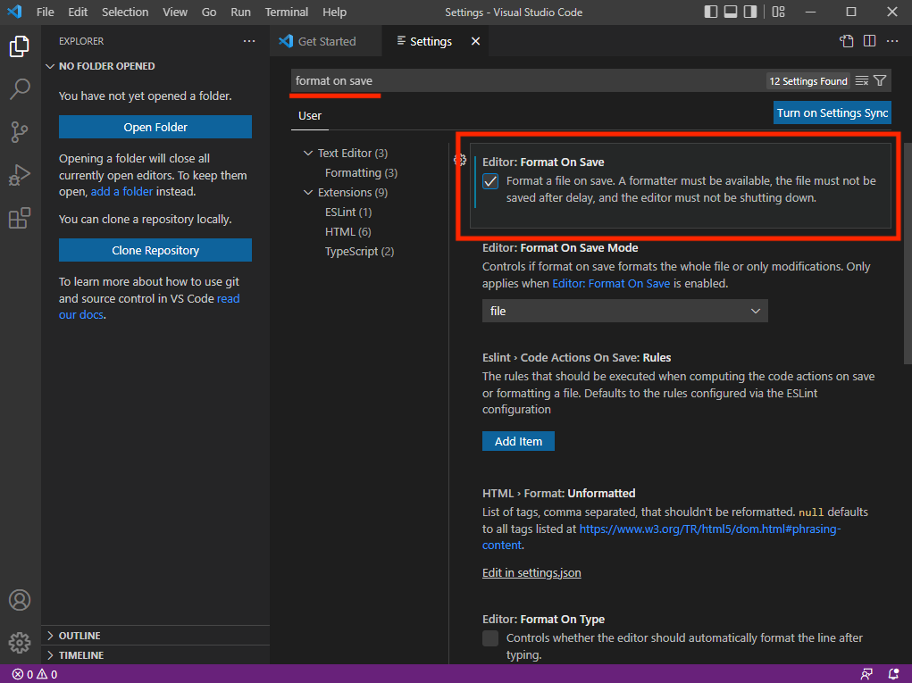
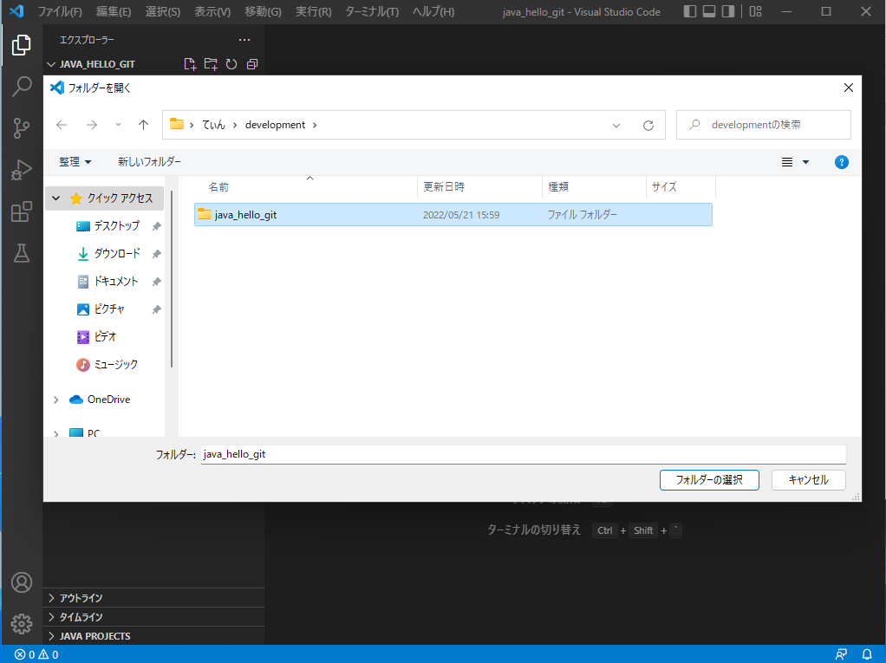
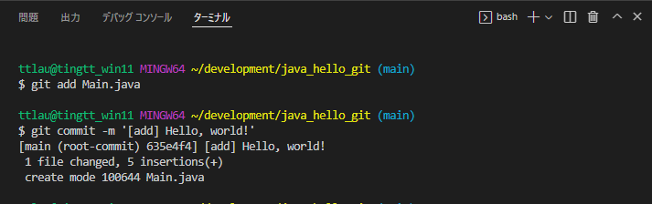
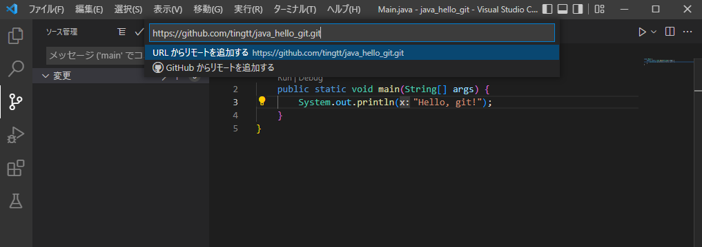

# Git / GitHub ハンズオン

## 準備

### Javaのインストール

#### ダウンロード

https://www.oracle.com/java/technologies/downloads からインストーラーをダウンロード


Windowsを選択してインストーラーをDL


#### インストール

ダブルクリックして実行
全て「次へ」でインストール


### Gitのインストール

#### ダウンロード

http://git-scm.com/download/ からインストーラをダウンロード


Windowsを選択してインストーラーをDL


#### インストール

ダブルクリックして実行


Windows TerminalでGit Bashを開けるようにする（しなくてもいいけどおすすめ）


初期ブランチ名を`main`にする（しなくてもいいけどおすすめ）


PowerShellからGitを使えるようにしておく（しなくてもいいけどおすすめ）


### VSCodeのインストール

#### ダウンロード

https://code.visualstudio.com/Download からインストーラをダウンロード


Windowsを選択してインストーラーをDL


#### インストール

ダブルクリックして実行


エクスプローラーからVSCodeを開けるようにする（しなくてもいいけどおすすめ）


#### 設定・拡張機能のインストール

日本語対応


Gitを使いやすくするやつ


ESLint（簡単に言うと隠れている警告を表示してくれるやつ）


Prettier（コード（プログラム）を自動できれいにしてくれるやつ）


コードを書きやすく色付けするやつ


全角スペースに色を付けてくれるやつ（全角スペースが隠れててエラーは結構あるから大事）


Javaを書いたり実行しやすくするやつ


設定を開いて


`format on save`で検索
セーブしたときに自動でコードを整形してくれるようにしておく



`terminal default profile`で検索
VSCode上で開くターミナルをGit Bashにしておく


## 実践

### フォルダを作成

フォルダの場所は好きなところで新規作成


フォルダの名前を決める（例：`java_hello_git`）


### VSCodeで作ったフォルダを開く

ファイル > フォルダーを開く



ショートカットから開く


### Javaで`Hello, world!`

`Main.java`を作成

```java
// Main.java
class Main {
	public static void main(String[] args) {
		System.out.println("Hello, world!");
        }
}
```


実行（Java Extention Packの機能）


コマンド ver.

ターミナルを開く [Ctrl + `]


ターミナルに次のコマンドを入れる
```bash
$ java Main.java
```


### GitHub登録

https://github.com

### Gitの設定

```bash
$ git config --global user.email "<メールアドレス>"
$ git config --global user.name "<ユーザー名>"
```


### フォルダをGitで管理


コマンド ver.

```bash
$ git init
```


### Gitでコミット（新しいバージョンを作る）

次のバージョンに変更を追加する（ステージ）


コミットメッセージ（新しいバージョンの変更点：何の機能を追加したか）を書いてコミット
（ctrl + Enterでもできる）


Gitログ（変更記録）を見る


<details><summary>コマンド ver.</summary>


```bash
# Main.javaをコミットに含める
$ git add Main.java

# コミットメッセージをつけてコミット
$ git commit -m '[add] Hello, world!'
```


</details>


### GitHubでリモートリポジトリ作成

リポジトリ作成


リポジトリ名、公開/非公開を決める


URLのコピー


### リモートリポジトリ登録

リモートの追加


コピーしたURLを入力してEnter



`origin`と入力してEnter


### リモートリポジトリにプッシュ（アップロード）


<details><summary>コマンド ver.</summary>

originという名前をつけてリモートリポジトリを追加する

```bash
$ git remote add origin <コピーしたurl>
```

head（今いるバージョン）をoriginにプッシュする

```bash
$ git push origin head
```


</details>

### 確認


### 新しいバージョンを作ってプッシュしてみる

```diff
-       System.out.println("Hello, world!");
+       System.out.println("Hello, git!");
```


#### コミット


#### プッシュ


<details><summary>コマンド ver.</summary>

```bash
$ git add Main.java
$ git commit -m '[update] hello world -> hello git'
$ git push origin head
```


</details>

#### 確認


