# Webサーバハンズオン - フロントエンド編

４年生が実際に制作しているWebサイトを使用したハンズオンです。  
`JavaScript`とそのフレームワークである`Next.js`を使用します。

## 前提

- Git [インストール資料](/articles/git_hands_on#Git%E3%81%AE%E3%82%A4%E3%83%B3%E3%82%B9%E3%83%88%E3%83%BC%E3%83%AB)
- VSCode [インストール資料](/articles/git_hands_on#VSCode%E3%81%AE%E3%82%A4%E3%83%B3%E3%82%B9%E3%83%88%E3%83%BC%E3%83%AB)

## 準備

### 　Node.jsとnpm

- `Node.js`
    - サーバーサイド（Webサイトなど）で`JavaScript`を使用する場合に使うWeb開発フレームワーク
- `npm`
    - JavaScriptのパッケージ管理ツール

#### DL

[Node.js](https://nodejs.org/)

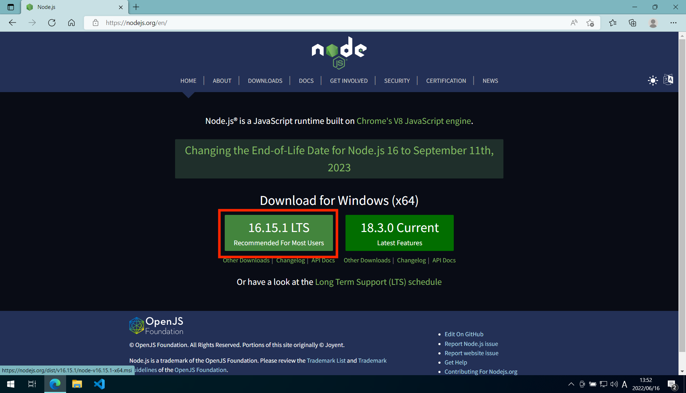

#### インストール

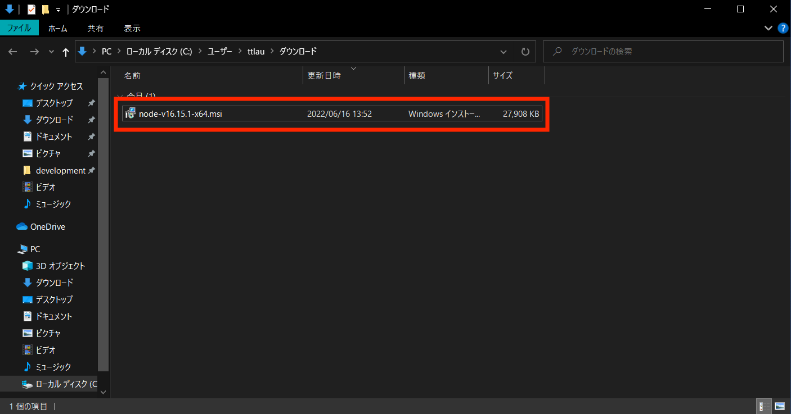

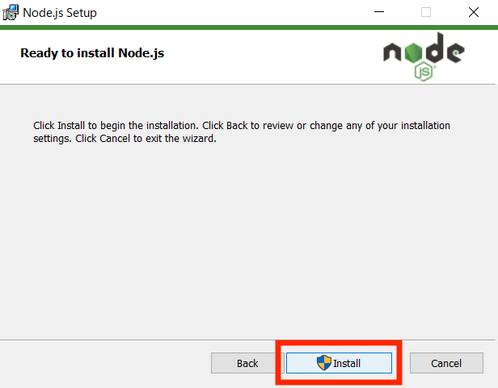

### yarn

`yarn`は`JavaScript`のパッケージ管理ツールで`npm`と用途は同じ

今回使用するWebサイトのプロジェクトをDLしたいフォルダを`GitBash`で開く


#### インストール

`yarn`をインストール

```bash
npm install -g yarn
```

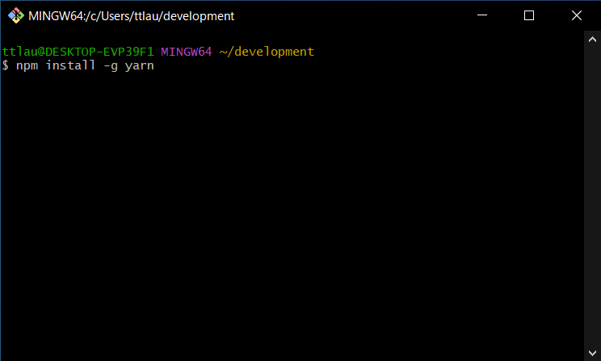

## 実践

[リポジトリ：ecc-proken/prc_hub-front](https://github.com/ecc-proken/prc_hub-front)

### GitHubからDL

さっき開いた`GitBash`で

```bash
git clone https://github.com/ecc-proken/prc_hub-front.git
```

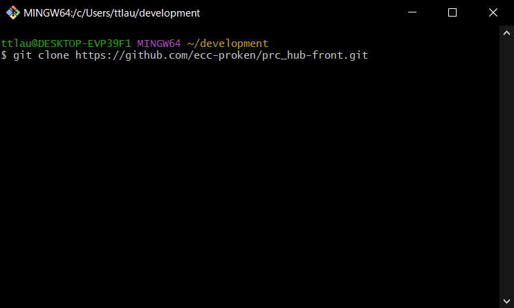

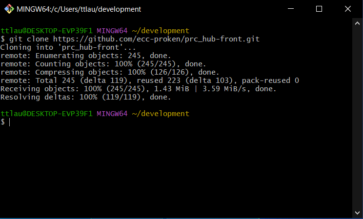

エクスプローラからも確認できる

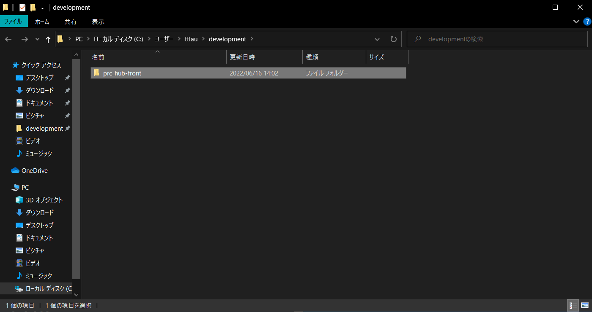

VSCodeで開く

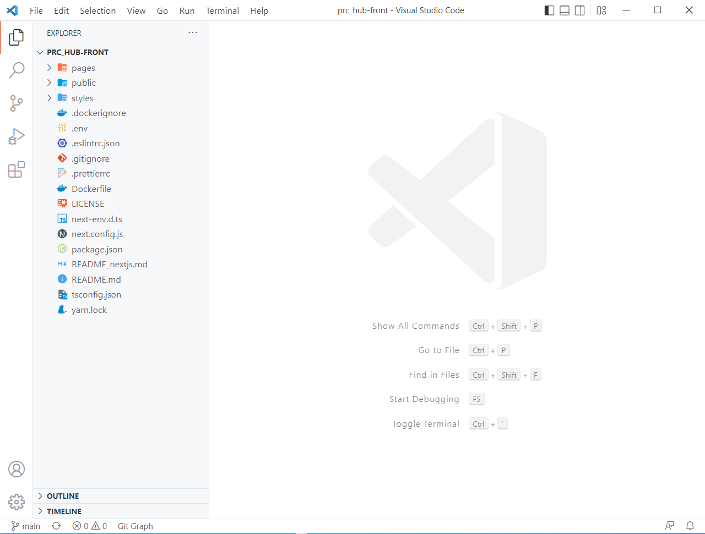

### windowsではそのまま実行できないため専用の設定をする。

ここからはコマンドを`VSCode`上の`GitBash`で実行してください。

↓のコマンドを全部コピーし、一度に実行する。

```bash
echo "/** @type {import('next').NextConfig} */
const nextConfig = {
  reactStrictMode: true,
  experimental: {
    outputStandalone: true,
  },
  swcMinify: false,
}

module.exports = nextConfig" > next.config.js
echo '{
    "presets": ["next/babel"]
}' > .babelrc
```


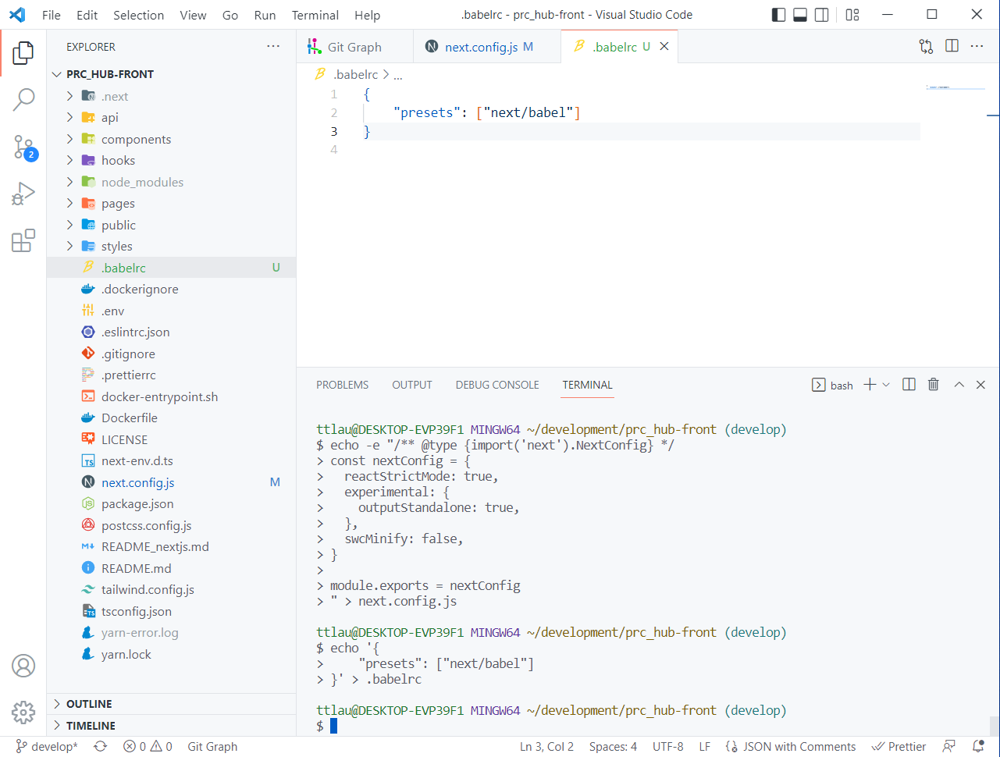

### Webサーバアプリケーションを動かしてみる

#### 必要パッケージのDL

```bash
yarn
```

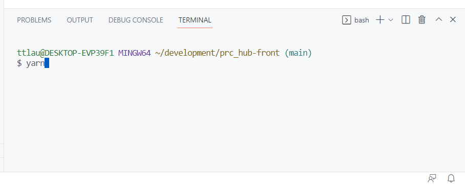

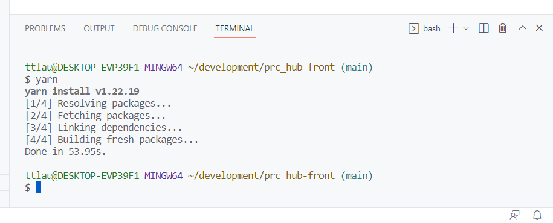

#### 環境変数の設定

`NEXT_PUBLIC_API_URL`という環境変数を`.env.local`というファイルに記述

```bash
echo "NEXT_PUBLIC_API_URL=https://prchub.tingtt.jp" > .env.local
```

#### 起動

```bash
yarn dev
```

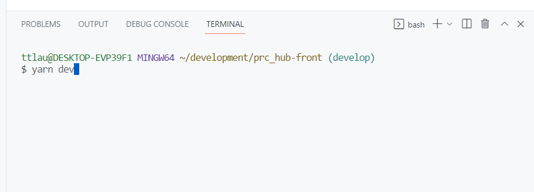

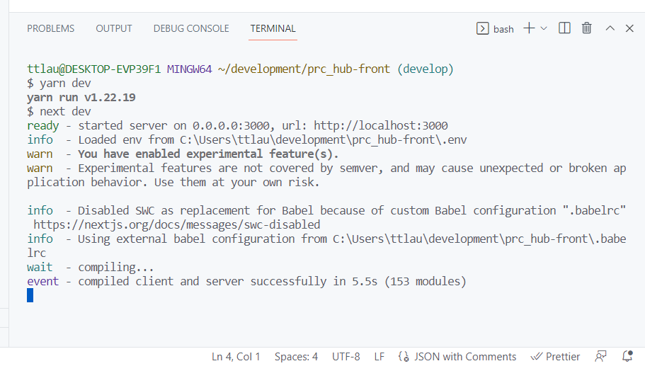

#### 見てみよう！

http://localhost:3000/

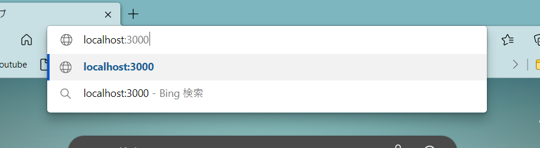

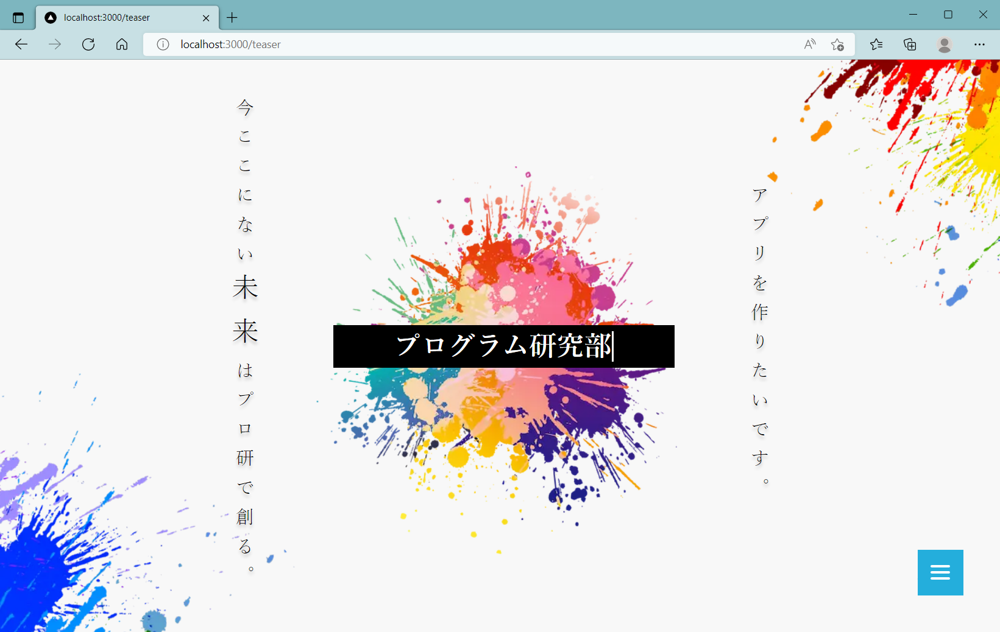

#### 止める

止めるときは`ctrl + c`

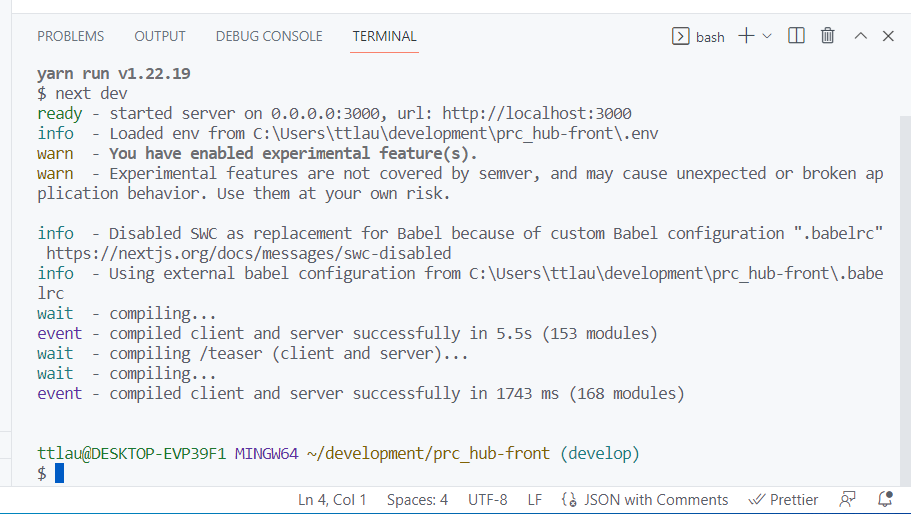

お疲れさまでした。