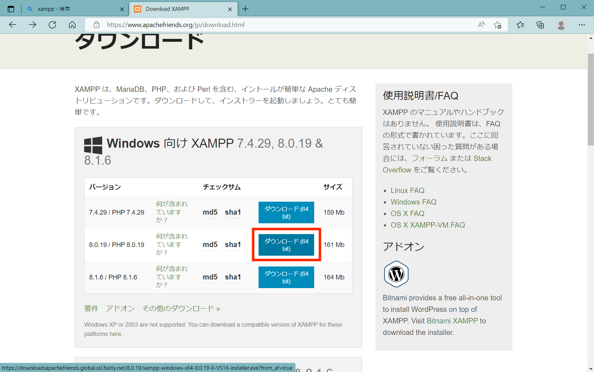
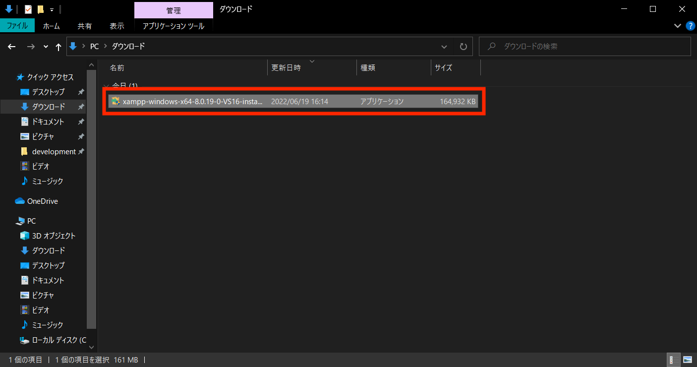
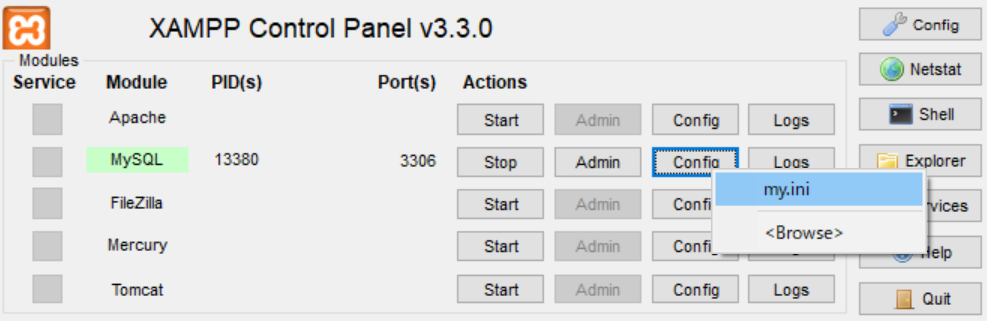
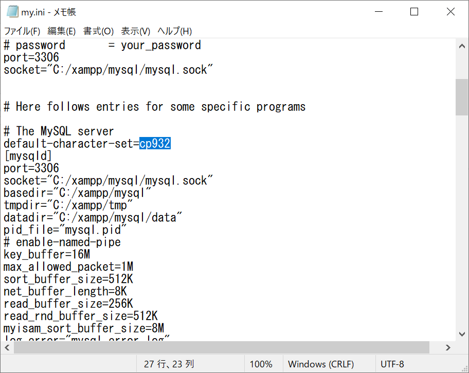
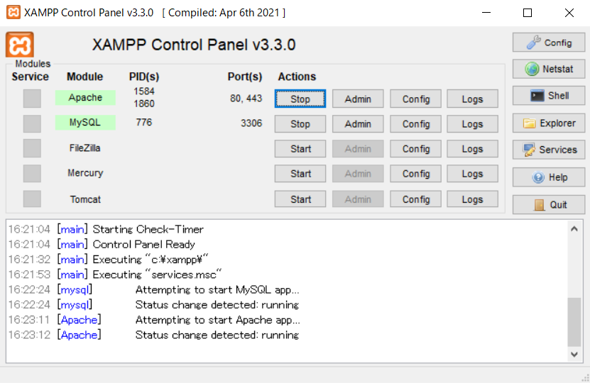
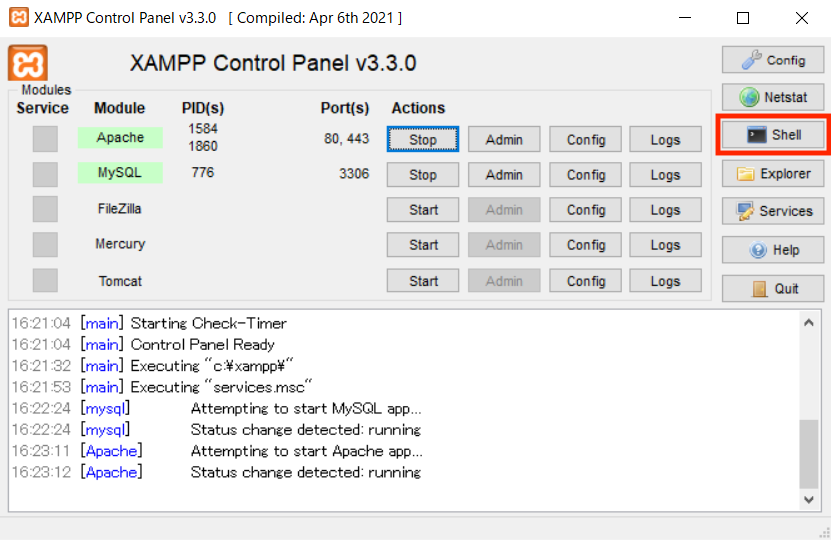
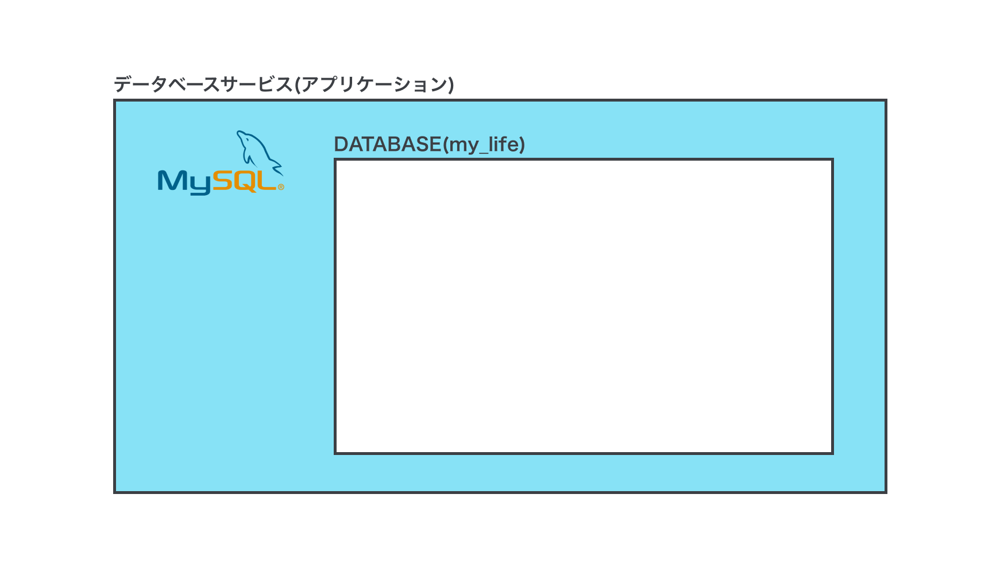
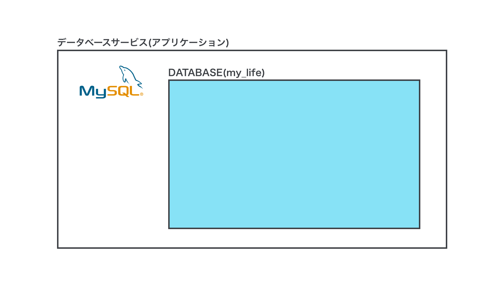
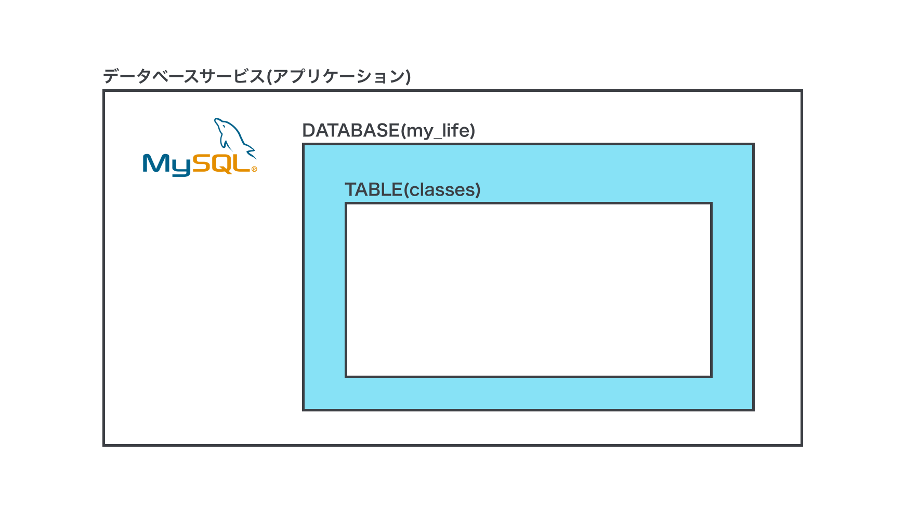
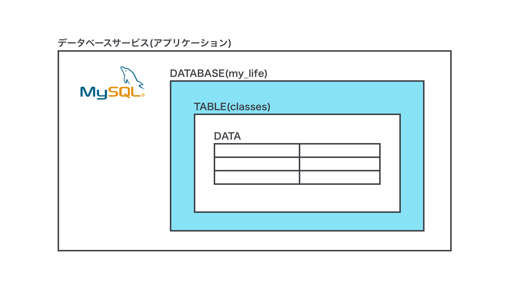

Contributed by [Ryota-nino](https://github.com/Ryota-nino)

# DB

Windowsに`MySQL`をインストールするのは少々面倒なので今回は`Xampp`を使います。  
`Xampp`は`Apache`や`DB`などのWebサイトの基本構成によく使用されるアプリケーションを簡易的に動かすことができるツールです。

## DL

[Xampp](https://www.apachefriends.org/jp/download.html)




## インストール

インストーラーでは、何も変更せずにインストールを進めてください。
途中でブラウザが開くと思いますが閉じてしまって構いません。




## 起動前の設定
`MySQL`の`Config`ボタンを押す。





default-character-set=`cp932`に変更し、`Ctrl+S`で保存して閉じる。


## 起動

`[Start]`を押して`MySQL`を起動してみましょう。





`MySQL`が起動できたら`[Shell]`を押してシェルを起動しましょう。



## データベース作成

以下のコマンドを入力し、パスワードを要求されるが、Enterを押す。
```mysql
 mysql -u root -p
```

シェルに以下のコマンドを入力し、`sys`や`test`などのデータベースがあることを確認する。
```mysql
mariaDB[(none)]> SHOW DATABASES;
```


以下のコマンドを入力し、データベースを作成する。
```mysql
mariaDB[(none)]> CREATE DATABASE my_life;
```

もう一度データベースを確認し、`my_life`データベースが追加されたことを確認する。
```mysql
mariaDB[(none)]> SHOW DATABASES;
```

今の状態を図で表すとこんな感じー。



以下のコマンドを入力し、`my_life`データベースに入る。
```mysql
mariaDB[(none)]> USE my_life;
```

今の状態以下略



## テーブル作成
以下のコマンドを入力し、テーブルが何もないことを確認する。
```mysql
mariaDB[my_life]> SHOW tables;
```
```mysql
Empty set (0.00 sec)
```


以下のコマンドを入力し、`classes`テーブルを作成する。
※idの後に書いてあるAUTO_INCREMENTはidが被らないように自動で割り振ってくれるオプションです。
```mysql
mariaDB[my_life]> CREATE TABLE classes (id INT AUTO_INCREMENT PRIMARY KEY, name TEXT, day_of_week TEXT);
```
```mysql
Query OK, 0 rows affected (0.07 sec)
```

以下のコマンドを入力し、`classes`テーブルが追加されたことを確認する。
```mysql
mariaDB[my_life]> SHOW tables;
```
```mysql
+-------------------+
| Tables_in_my_life |
+-------------------+
| classes           |
+-------------------+
1 row in set (0.01 sec)
```




## Create & Read
以下のコマンドを入力し、テーブルの中身がないことを確認する。
※`*`はid,name,day_of_weekなどの「`列名`を全て取得します」という意味です。
```mysql
mariaDB[my_life]> SELECT * FROM classes;
```
```mysql
Empty set (0.02 sec)
```


以下のコマンドを使用して、自分が受けている授業を3つ以上入力する。
例）
INSERT INTO classes(name, day_of_week) VALUES ('セキュリティ演習', '月');
INSERT INTO classes(name, day_of_week) VALUES ('ITシステム開発演習', '火');
INSERT INTO classes(name, day_of_week) VALUES ('ITゼミ演習', '木');

```mysql
mariaDB[my_life]> INSERT INTO classes(name, day_of_week) VALUES ('授業名', '曜日');
```
```mysql
Query OK, 0 rows affected (0.07 sec)
```


以下のコマンドを入力し、追加したデータが全て表示されることを確認する。
```mysql
mariaDB[my_life]> SELECT * FROM classes;
```
```mysql
+----+----------------------------+-------------+
| id | name                       | day_of_week |
+----+----------------------------+-------------+
|  1 | セキュリティ演習              | 月          |
|  2 | ITシステム開発演習            | 火          |
|  3 | ITゼミ演習                  | 木          |
+----+----------------------------+-------------+
3 rows in set (0.00 sec)
```



## Update

以下のコマンドを使用して、授業名を変更してみる。
```mysql
mariaDB[my_life]> UPDATE classes SET name = '変更後の授業名' WHERE name = '変更前の授業名';
```
```mysql
Query OK, 1 row affected (0.00 sec)
Rows matched: 1  Changed: 1  Warnings: 0
```


以下のコマンドを入力し、授業名が更新されたことを確認する。
```mysql
mariaDB[my_life]> SELECT * FROM classes;
```

## Delete


以下のコマンドを使用して、授業データを削除してみる。
```mysql
mariaDB[my_life]> DELETE FROM classes WHERE name = '削除する授業名';
```

以下のコマンドを入力し、授業データが削除されたことを確認する。
```mysql
mariaDB[my_life]> SELECT * FROM classes;
```
```mysql
+----+----------------------------+-------------+
| id | name                       | day_of_week |
+----+----------------------------+-------------+
|  2 | ITシステム開発演習            | 火          |
|  3 | ITゼミ演習                  | 木          |
+----+----------------------------+-------------+
2 rows in set (0.00 sec)
```

## 曜日指定のSELECT文

`WHERE`を使うとSELECT文に条件を付けることができる。
```mysql
mariaDB[my_life]> SELECT * FROM classes WHERE day_of_week = '表示したい曜日';
```
```mysql
+----+----------------------------+-------------+
| id | name                       | day_of_week |
+----+----------------------------+-------------+
|  2 | ITシステム開発演習            | 火          |
+----+----------------------------+-------------+
1 row in set (0.00 sec)
```

## 最後にXAMPPのMySQLを`Stop`する。

<!-- # 以上！お疲れ様！！帰ってゆっくり寝ろ！！！ -->
