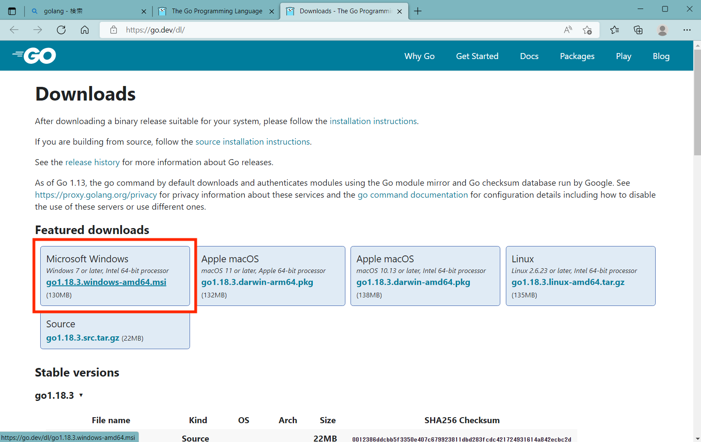

# Webサーバハンズオン - バックエンド編

４年生が実際に制作しているWebサイトのバックエンドを使用したハンズオンです。
`Go言語`とそのフレームワークである`echo`を使用します。

## 前提

- Git [インストール資料](/articles/git_hands_on#Git%E3%81%AE%E3%82%A4%E3%83%B3%E3%82%B9%E3%83%88%E3%83%BC%E3%83%AB)  
- VSCode [インストール資料](/articles/git_hands_on#VSCode%E3%81%AE%E3%82%A4%E3%83%B3%E3%82%B9%E3%83%88%E3%83%BC%E3%83%AB)

## 準備

### Go

バックエンドやミドルウェア、OSの開発によく利用される言語

#### DL

[Go](https://go.dev/dl)




#### インストール


### DB

Windowsに`MySQL`をインストールするのは少々面倒なので今回は`Xampp`を使います。  
`Xampp`は`Apache`や`DB`などのWebサイトの基本構成によく使用されるアプリケーションを簡易的に動かすことができるツールです。

#### DL

[Xampp](https://www.apachefriends.org/jp/download.html)


#### インストール

インストーラーでは、何も変更せずにインストールを進めてください。
途中でブラウザが開くと思いますが閉じてしまって構いません。


#### 起動

`[Start]`を押して`Apache`と`MySQL`を起動してみましょう。


## 実践

[リポジトリ：ecc-proken/prc_hub-back](https://github.com/ecc-proken/prc_hub-back)

### GitHubからDL

```bash
git clone https://github.com/ecc-proken/prc_hub-back.git
```


### VSCodeで開く


### DBの作成

#### XamppからDB管理ページを開く


#### SQLの実行

専用のSQLがあるのでこれを貼り付けて実行

```sql
SET SQL_MODE = "NO_AUTO_VALUE_ON_ZERO";
START TRANSACTION;

--
-- Database: `prc_hub`
--

CREATE DATABASE IF NOT EXISTS `prc_hub` DEFAULT CHARACTER SET utf8mb4 COLLATE utf8mb4_general_ci;
USE `prc_hub`;

--
-- Table structure for table `users`
--

CREATE TABLE `users` (
  `id` BIGINT UNSIGNED NOT NULL AUTO_INCREMENT,
  `name` VARCHAR(255) NOT NULL,
  `email` VARCHAR(255) NOT NULL,
  `password` VARCHAR(255) NOT NULL,
  `github_username` VARCHAR(255),
  `twitter_id` VARCHAR(255),
  `post_event_availabled` TINYINT(1) NOT NULL DEFAULT '0',
  `admin` TINYINT(1) NOT NULL DEFAULT '0',
  `migrated_admin` TINYINT(1) NOT NULL DEFAULT '0',
  `created_at` DATETIME NOT NULL DEFAULT CURRENT_TIMESTAMP,
  `updated_at` DATETIME NOT NULL DEFAULT CURRENT_TIMESTAMP ON UPDATE CURRENT_TIMESTAMP,
  PRIMARY KEY (id)
);

--
-- Table structure for table `github_oauth2_tokens`
--

CREATE TABLE `github_oauth2_tokens` (
  `id` bigint UNSIGNED NOT NULL AUTO_INCREMENT,
  `user_id` bigint UNSIGNED NOT NULL UNIQUE,
  `access_token` varchar(255) NOT NULL,
  `owner_id` bigint UNSIGNED NOT NULL,
  PRIMARY KEY (id),
  FOREIGN KEY (user_id) REFERENCES users(id) ON DELETE CASCADE
);

--
-- Table structure for table `events`
--

CREATE TABLE `events` (
  `id` BIGINT UNSIGNED NOT NULL AUTO_INCREMENT,
  `user_id` BIGINT UNSIGNED,
  `title` VARCHAR(255) NOT NULL,
  `description` VARCHAR(255),
  `location` VARCHAR(255),
  `published` TINYINT(1) NOT NULL DEFAULT '1',
  `completed` TINYINT(1) NOT NULL DEFAULT '0',
  `created_at` DATETIME NOT NULL DEFAULT CURRENT_TIMESTAMP,
  `updated_at` DATETIME NOT NULL DEFAULT CURRENT_TIMESTAMP ON UPDATE CURRENT_TIMESTAMP,
  FOREIGN KEY (`user_id`) REFERENCES `users` (`id`) ON DELETE SET NULL,
  PRIMARY KEY (id)
);

--
-- Table structure for table `event_speakers`
--

CREATE TABLE `event_speakers` (
  `event_id` BIGINT UNSIGNED NOT NULL,
  `user_id` BIGINT UNSIGNED NOT NULL,
  `created_at` DATETIME NOT NULL DEFAULT CURRENT_TIMESTAMP,
  `updated_at` DATETIME NOT NULL DEFAULT CURRENT_TIMESTAMP ON UPDATE CURRENT_TIMESTAMP,
  FOREIGN KEY (`event_id`) REFERENCES `events` (`id`) ON DELETE CASCADE,
  FOREIGN KEY (`user_id`) REFERENCES `users` (`id`) ON DELETE CASCADE
);

--
-- Table structure for table `event_datetimes`
--

CREATE TABLE `event_datetimes` (
  `id` BIGINT UNSIGNED NOT NULL AUTO_INCREMENT,
  `event_id` BIGINT UNSIGNED NOT NULL,
  `start` DATETIME NOT NULL,
  `end` DATETIME,
  `created_at` DATETIME NOT NULL DEFAULT CURRENT_TIMESTAMP,
  `updated_at` DATETIME NOT NULL DEFAULT CURRENT_TIMESTAMP ON UPDATE CURRENT_TIMESTAMP,
  FOREIGN KEY (`event_id`) REFERENCES `events` (`id`) ON DELETE CASCADE,
  PRIMARY KEY (id)
);

--
-- Table structure for table `event_participates`
--

CREATE TABLE `event_participates` (
  `event_datetime_id` BIGINT UNSIGNED NOT NULL,
  `user_id` BIGINT UNSIGNED NOT NULL,
  `created_at` DATETIME NOT NULL DEFAULT CURRENT_TIMESTAMP,
  `updated_at` DATETIME NOT NULL DEFAULT CURRENT_TIMESTAMP ON UPDATE CURRENT_TIMESTAMP,
  FOREIGN KEY (`event_datetime_id`) REFERENCES `event_datetimes` (`id`) ON DELETE CASCADE,
  FOREIGN KEY (`user_id`) REFERENCES `users` (`id`) ON DELETE CASCADE
);

--
-- Table structure for table `event_documents`
--

CREATE TABLE `event_documents` (
  `id` BIGINT UNSIGNED NOT NULL AUTO_INCREMENT,
  `event_id` BIGINT UNSIGNED NOT NULL,
  `name` VARCHAR(255) NOT NULL,
  `url` VARCHAR(255) NOT NULL,
  `created_at` DATETIME NOT NULL DEFAULT CURRENT_TIMESTAMP,
  `updated_at` DATETIME NOT NULL DEFAULT CURRENT_TIMESTAMP ON UPDATE CURRENT_TIMESTAMP,
  FOREIGN KEY (`event_id`) REFERENCES `events` (`id`) ON DELETE CASCADE,
  PRIMARY KEY (id)
);
```

貼り付け


実行


成功したらこんな表示


リロードすると`prc_hub`というデータベースが追加されている。


DBの準備はこれで完了

### 実行

バックエンドの方のVSCodeに戻って


コマンド実行

```bash
go run main.go \
    --allow-origin http://localhost:3000 \
    --mysql-host localhost \
    --mysql-user root \
    --mysql-database prc_hub \
    --jwt-secret secret \
    --admin-email admin@prchub.com \
    --admin-password password
```


動きっぱなしにしておく必要があるのでそのままにしておきましょう。

### フロントエンドから繋げてみよう

以前使ったフロントエンドのプロジェクトをVSCodeで新しいウィンドウから開く


#### 環境変数の設定

```bash
echo "NEXT_PUBLIC_API_URL=http://localhost:1323" > .env.local
```


#### 起動

```bash
yarn dev
```


#### 見てみよう！

- フロントエンド
  http://localhost:3000/events

  


  


  データがないので何も表示されない。

- バックエンド
  http://localhost:1323/events

  
  
  
  
  
  
  


### データを追加してみよう！

また、DBの管理画面からコピペで実行

```sql
USE `prc_hub`;

--
-- Dumping data for table `events`
--

LOCK TABLES `events` WRITE;
/*!40000 ALTER TABLE `events` DISABLE KEYS */;
INSERT INTO `events` VALUES (1,1,'ITシステムの構造','Webサイトやモバイルアプリなどのサービスがどのようにして成り立っているのか全体像を勉強します！\n図を使って基礎的なことを説明するのでかなりわかりやすいと思います！','2302',1,0,'2022-06-19 11:13:55','2022-06-19 11:13:55'),(2,1,'Git/GitHubハンズオン','エンジニア必須スキルのGitとGitHubのハンズオンを行います。\nGit/GitHubはITシステムを開発する上でよく利用する技術・サービスです。','2302',1,0,'2022-06-19 11:13:55','2022-06-19 11:13:55'),(3,1,'Webサーバハンズオン','4年生が実際に開発しているWebサイトを題材にハンズオンを行います。\n題材ははNext.js(React.js/node.js)というWebサイト などを作るJavaScriptのフレームワークを利用しています。','2302',1,0,'2022-06-19 11:13:55','2022-06-19 11:13:55');
/*!40000 ALTER TABLE `events` ENABLE KEYS */;
UNLOCK TABLES;

--
-- Dumping data for table `event_speakers`
--

LOCK TABLES `event_speakers` WRITE;
/*!40000 ALTER TABLE `event_speakers` DISABLE KEYS */;
INSERT INTO `event_speakers` VALUES (1,1,'2022-06-19 11:13:55','2022-06-19 11:13:55'),(2,1,'2022-06-19 11:13:55','2022-06-19 11:13:55'),(3,1,'2022-06-19 11:13:55','2022-06-19 11:13:55');
/*!40000 ALTER TABLE `event_speakers` ENABLE KEYS */;
UNLOCK TABLES;

--
-- Dumping data for table `event_datetimes`
--

LOCK TABLES `event_datetimes` WRITE;
/*!40000 ALTER TABLE `event_datetimes` DISABLE KEYS */;
INSERT INTO `event_datetimes` VALUES (1,1,'2022-05-16 08:15:00','2022-05-16 09:00:00','2022-06-19 11:13:55','2022-06-19 11:13:55'),(2,1,'2022-05-17 08:15:00','2022-05-17 09:00:00','2022-06-19 11:13:55','2022-06-19 11:13:55'),(3,1,'2022-05-20 09:45:00','2022-05-20 10:30:00','2022-06-19 11:13:55','2022-06-19 11:13:55'),(4,2,'2022-05-23 08:15:00','2022-05-23 09:00:00','2022-06-19 11:13:55','2022-06-19 11:13:55'),(5,2,'2022-05-24 08:15:00','2022-05-24 09:00:00','2022-06-19 11:13:55','2022-06-19 11:13:55'),(6,2,'2022-05-27 09:45:00','2022-05-27 10:30:00','2022-06-19 11:13:55','2022-06-19 11:13:55'),(7,3,'2022-06-17 09:45:00','2022-06-17 10:30:00','2022-06-19 11:13:55','2022-06-19 11:13:55'),(8,3,'2022-06-20 08:15:00','2022-06-20 09:00:00','2022-06-19 11:13:55','2022-06-19 11:13:55'),(9,3,'2022-06-21 08:15:00','2022-06-21 09:00:00','2022-06-19 11:13:55','2022-06-19 11:13:55');
/*!40000 ALTER TABLE `event_datetimes` ENABLE KEYS */;
UNLOCK TABLES;

--
-- Dumping data for table `event_documents`
--

LOCK TABLES `event_documents` WRITE;
/*!40000 ALTER TABLE `event_documents` DISABLE KEYS */;
INSERT INTO `event_documents` VALUES (1,1,'スライド','https://github.com/ecc-proken/StudyGroup/blob/main/20220516-it_system/slide.pdf','2022-06-19 11:13:55','2022-06-19 11:13:55'),(2,2,'ハンズオン資料','https://github.com/ecc-proken/StudyGroup/blob/main/20220523-git_hands_on/DOCUMENT.md','2022-06-19 11:13:55','2022-06-19 11:13:55'),(3,2,'スライド','https://github.com/ecc-proken/StudyGroup/blob/main/20220523-git_hands_on/slide.pdf','2022-06-19 11:13:55','2022-06-19 11:13:55');
/*!40000 ALTER TABLE `event_documents` ENABLE KEYS */;
UNLOCK TABLES;
```


実行


#### 見てみよう！

- バックエンド
  `JSON`と呼ばれる形式で表示される
  
  
  
  
  
  
  
  
  
  
  
  
  
  
  
  
  
  

- フロントエンド
  バックエンドから取得した`JSON`が解析され、HTMLを構築する。
  


### 停止

止めるときは`ctrl + c`

- フロントエンド


- バックエンド


- DB
`[stop]`を押して停止


お疲れさまでした。